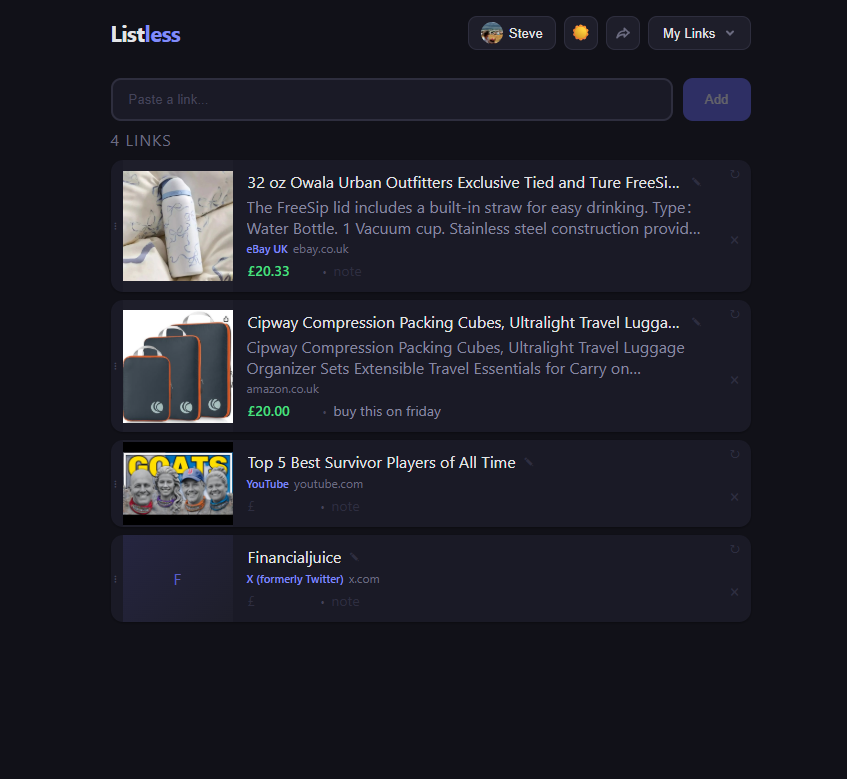

# Listless

A single-page link collection app. Paste URLs, preview metadata, organise into lists.



## Features

- URL metadata fetching (title, description, image, publisher, price)
- Editable price, note and title fields per card
- Custom image upload for cards
- Drag-and-drop reorder with grip handles
- Multiple named lists
- Dark/light mode
- Undo support
- Google sign-in with cross-device sync (Firebase/Firestore)
- Collaborative lists - invite members by email with notifications, owner/member roles, real-time sync
- Share lists via link (read-only for viewers)
- Export/import lists as JSON
- In-page modals for all confirmations

## Usage

Serve over HTTP (Firebase Auth requires it):

```
npx serve .
```

Then open `http://localhost:3000`.

Also available via GitHub Pages.

## Setup

See [SETUP.md](SETUP.md) for a full step-by-step walkthrough including all third-party accounts.

Requires a Firebase project (Blaze plan) with:
- **Authentication** - Google sign-in enabled
- **Firestore** - for user data, collaborative lists, and shared links
- **App Check** - reCAPTCHA v3 attestation to block automated abuse
- **Trigger Email from Firestore** extension - sends invite emails via Brevo SMTP

Firebase config is embedded in `index.html`. Firestore collections:
- `lists/{id}` - per-list documents with member arrays and items
- `invites/{id}` - pending email invites resolved on sign-in
- `shared/{id}` - read-only snapshots for share links
- `users/{uid}` - active list preference
- `mail/{id}` - email documents processed by the Trigger Email extension

## Third-party services

| Service | Purpose | Plan | Free tier | Typical cost | Emergency stop |
|---------|---------|------|-----------|-------------|----------------|
| **Firebase Auth** | Google sign-in | Blaze (pay-as-you-go) | 50k MAU | Free at low volume | Firebase Console > Authentication > Settings > disable sign-in method |
| **Firestore** | Data storage, real-time sync | Blaze (pay-as-you-go) | 50k reads, 20k writes/day | Free at low volume | Firebase Console > Firestore > Rules > deny all, or delete the database |
| **Firebase Trigger Email** | Sends invite emails | Free (extension) | N/A - uses SMTP provider | Free | Firebase Console > Extensions > uninstall the extension |
| **Brevo** | SMTP email delivery | Free | 300 emails/day, no expiry | Free | Brevo dashboard > Settings > SMTP & API > delete SMTP key |
| **Cloudflare Workers** | Metadata proxy for sites that block scrapers | Free | 100k requests/day | Free | Cloudflare dashboard > Workers > delete or disable the worker |
| **Microlink** | Primary URL metadata API | Free | 50 requests/day | Free | No account needed - just stop calling the API |
| **Noembed** | Fallback metadata for embeddable content | Free | Unlimited | Free | No account needed |
| **GitHub Pages** | Hosting | Free | Unlimited for public repos | Free | Repo Settings > Pages > disable |

### Budget protection

- Google Cloud budget alert at $1/month with email notifications at 50%, 90%, and 100%
- Firestore monitoring alert emails if document reads exceed 500 in a 5-minute window
- To fully stop all paid Firebase services: Firebase Console > Blaze plan > downgrade to Spark (free). This disables extensions and any paid-tier usage immediately

## Security

### Authentication and access control
- **Mandatory Google sign-in** - no anonymous access to app data
- **Firestore security rules** - per-collection rules restricting reads/writes to authenticated members only; shared docs write-locked to their creator via `ownerUid`
- **Firebase App Check with reCAPTCHA v3** - silently verifies requests come from a real browser running the actual app, blocking scripts and bots from abusing the API

### API and network protection
- **Firebase API key domain restriction** - key restricted to allowed domains in Google Cloud Console; other origins are rejected
- **Content Security Policy (CSP)** - browser-enforced policy restricting which domains the app can connect to, load scripts from, or frame
- **Cloudflare Worker origin check** - metadata proxy only responds to requests from allowed domains
- **Cloudflare Worker SSRF protection** - blocks requests to private IPs, localhost, internal hosts, and non-http(s) protocols

### Input validation
- **Email format validation** - rejects invalid emails when adding members
- **Data attribute escaping** - prevents HTML injection from special characters in user input

### Repo hygiene
- **No secrets in repo** - SMTP keys, service accounts, and reCAPTCHA secret keys are stored in Firebase/Brevo/Google Cloud, not in code
- **`.gitignore`** - `.claude/` directory and `LINKS.md` (admin URLs) excluded from repo
- **`firestore.rules`** - security rules committed for visibility and verification
- **`/* UPDATE: */` comments** - all lines needing customisation are flagged for new users
